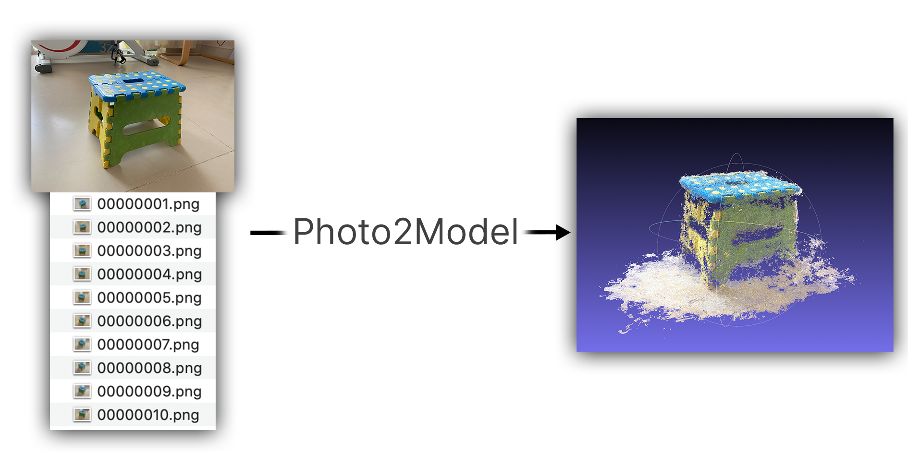

# Photo2Model-MVS

Photo2Model is a complete 3D reconstruction pipeline based on [COLMAP](https://colmap.github.io/install.html) and [PointMVSNet](https://github.com/callmeray/PointMVSNet) that only requires a set of photos as inputs.



## Prerequisite

* [COLMAP]( https://colmap.github.io/install.html), tested under versions >= 3.6

## Download

```bash
git clone https://github.com/PKU-VCL-3DV/MVS.git && cd MVS
```

## Install Dependencies

```bash
bash ./install_dependencies.sh
```

Compile CUDA extensions

```bash
bash ./compile.sh
```


## Photo2Model

### Photos

Photos should be placed under `./data/images`. Make sure that photos are named in an ordered `{:08d}.png`(or `{:08d}.jpg`) format, starting from `00000000.png`(or `00000000.jpg`).

To help rename your photos, EITHER run

```bash
python ./renamePhotos.py
```

OR, to **delete** the unrenamed photos,

```bash
python ./renamePhotos.py -d
```


### COLMAP

**This step requires a GPU, so make sure to check the script before you run on the specified GPU.**
To calibrate the cameras using COLMAP, run

```bash
bash ./runCOLMAP.sh
```


### Convert Parameters into Matrices

```bash
python ./colmap2matrices.py
```


### PointMVSNet

Remember to adjust the image resolution and the number of virtual planes in `./configs/photo2model.yaml`.

Under the conda environment `Photo2Model`, run

```bash
python pointmvsnet/test.py --cfg configs/photo2model.yaml TEST.WEIGHT ./model.pth
```


### Fuse

To convert the depth maps into a complete 3D model, run

```bash
python fuse_depthmaps.py
```


